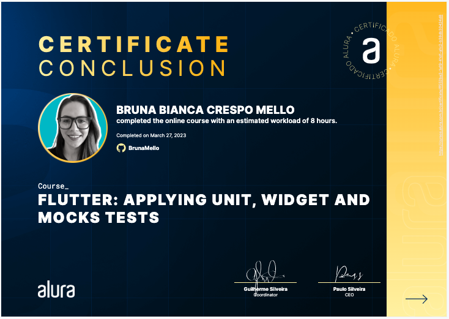

# Flutter: Unit, Widget and Mocks Tests

This Flutter course will teach you how to:

- > Check an unknown code

- > Create Quality mechanisms for your product

- > Formulate tests

- > Use sophisticated widget search methods

- > Create reliability to your code.

## 🔨 Project: AluraBank

The course project consists of creating several tests in a new project, in order to instruct on the quality of the applications created by the student!

## ✔️ Techniques and technologies

**Take a closer look at what you will learn about:** :
- `Unit Test`: Test capable of checking small objects.
- `Widget Test`: Test capable of checking widgets and their dependencies, with screen construction.
- `test()`: method capable of starting a test.
- `expect()`: method that compares the test result with the expected.
- `group()`: method that groups different tests.
- `pump()`: method that awaits micro processes for construction on the screen.
- `Finders`: Those with the ability to search and find widgets in an extensive tree being tested..
- `Matchers`: Those with the ability to compare a result with that expected;
- `Actions`: Activities that o `tester` can take advantage to ensure the usability of the application. 
- `Mock`: Those with the ability to imitate a dependency.
- `mockito`: Package that allows the creation of stuntmen.

## 🛠️ Open and run the project

**To run this project you need:**

- Having an IDE, which can be the  [Android Studio](https://developer.android.com/) installed on 
  your machine
- Have the [SDK do Flutter](https://docs.flutter.dev/get-started/install) in version 3.0.0

## 📚 More Information

Certificate: 'https://cursos.alura.com.br/certificate/ff552ba3-1a19-41d1-a1c2-b38db30424d8'

